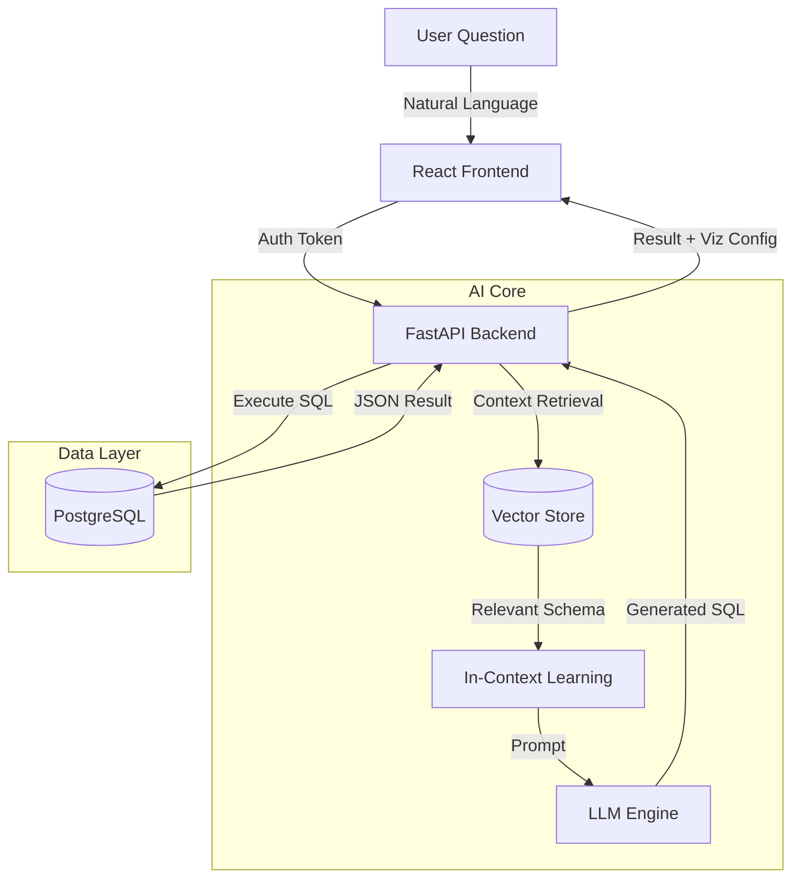

# English2SQL: Enterprise-Grade Natural Language Interface to Databases


**English2SQL** is a production-ready interface that democratizes data access by allowing non-technical users to query complex SQL databases using plain English.

By leveraging **Schema-Aware RAG (Retrieval Augmented Generation)** and a refined LLM pipeline, this system achieves a **9% accuracy improvement** over baseline text-to-SQL models, significantly reducing hallucination rates in enterprise environments.

---

## 🚀 Key Features

- **Natural Language Querying**: Converts complex questions ("Show me top 5 users by spend in NY last month") into optimized SQL.
- **Schema-Aware RAG**: Dynamically retrieves relevant table schemas and context before generation, ensuring queries are syntactically and semantically correct.
- **Enterprise Security**:
  - **role-based access control (RBAC)** via Firebase Auth.
  - Sanitized inputs to prevent SQL injection.
- **Interactive Data Visualization**: Automatically renders results as dynamic tables or charts based on data type.

## 🏗️ Architecture



## 🛠️ Tech Stack

### Frontend & Auth (This Repository)

- **Framework**: React 18 (CRA)
- **Styling**: Bootstrap 5 + Custom CSS
- **Authentication**: Firebase (Google OAuth)
- **State Management**: Jotai

### Backend Integration (Connected Service)

- **API**: FastAPI (Python)
- **AI Orchestration**: LangChain + OpenAI/Ollama
- **Database**: PostgreSQL (AWS RDS)

## 🎥 Demo

> *See the system in action converting varied business questions into precise SQL.*


## 📦 Installation (Frontend)

To run this interface locally:

1. **Clone the repository**

    ```bash
    git clone https://github.com/Rayhanpatel/English2SQL.git
    cd English2SQL
    ```

2. **Install Dependencies**

    ```bash
    npm install
    ```

3. **Configure Environment**
    Create a `.env` file with your Firebase config:

    ```env
    REACT_APP_FIREBASE_API_KEY=your_key
    REACT_APP_FIREBASE_AUTH_DOMAIN=your_domain
    ...
    ```

4. **Start the App**

    ```bash
    npm start
    ```

    Open [http://localhost:3000](http://localhost:3000) to view it in the browser.

## 📄 License

This project is licensed under the MIT License - see the [LICENSE](LICENSE) file for details.

---

<div align="center">
  <sub>Built by <a href="https://github.com/Rayhanpatel">Rayhan Patel</a></sub>
</div>
